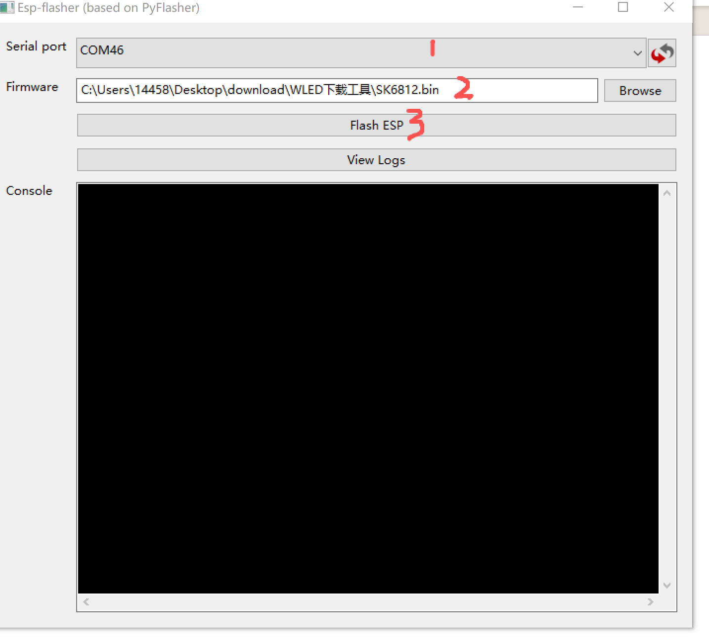

# H705D / SM6812 固件烧录说明

本分支用于 H705D 控制器，包含 SM6812 固件、ESP-Flasher 烧录工具和 CP210x Windows 串口驱动。

## 文件说明

| 路径 | 用途 |
| --- | --- |
| `firmware/SM6812/SK6812.bin` | 使用 ESP-Flasher 时加载的合并固件 |
| `firmware/SM6812/firmware.bin` | 原始应用固件 |
| `firmware/SM6812/bootloader_dout_40m.bin` | Bootloader |
| `firmware/SM6812/partitions.bin` | 分区表 |
| `firmware/SM6812/boot_app0.bin` | Boot app |
| `firmware/SM6812/烧录Offset.txt` | 多文件烧录偏移地址参考 |
| `tools/ESP-Flasher.exe` | Windows 图形化烧录工具 |
| `drivers/CP210x_Universal_Windows_Driver_WIN7_8.zip` | CP210x USB 转串口驱动 |

## 烧录前准备

1. 使用 USB 数据线把控制器连接到 Windows 电脑。
2. 如果系统没有出现 COM 端口，解压并安装 `drivers/CP210x_Universal_Windows_Driver_WIN7_8.zip`，安装后重新插拔控制器。
3. 关闭可能占用串口的软件，例如串口监视器、其他烧录工具或 WLED 日志窗口。
4. 确认控制器型号为 H705D，并确认要写入的是本分支的 `SK6812.bin`。

## Method B – 使用 ESP-Flasher 烧录

此流程依据 Wellvow 教程的 **Method B – Flash with ESP-Flasher**，并结合本固件包的实际路径：

1. 运行 `tools/ESP-Flasher.exe`。
2. 在 **Serial port** 下拉框中选择控制器对应的 COM 端口；如果刚安装驱动，可点击右侧刷新按钮。
3. 在 **Firmware** 一栏点击 **Browse**。
4. 选择 `firmware/SM6812/SK6812.bin`。这是本流程需要加载的单个合并固件文件。
5. 点击 **Flash ESP** 开始烧录。
6. 保持 USB 连接，等待进度达到 100% 并确认烧录成功。
7. 断电重启控制器，或拔下 USB 后重新连接。

图中编号含义：

1. 选择正确的 COM 端口。
2. 点击 **Browse** 并加载本仓库的 `firmware/SM6812/SK6812.bin`。
3. 点击 **Flash ESP**。

### 注意事项与故障排查

- 烧录过程中不要断开 USB、电源或关闭工具。
- 必须使用与 H705D/SM6812 控制器匹配的固件；错误固件可能导致设备无法启动。
- 如果没有 COM 端口，请安装 CP210x 驱动、换一根支持数据传输的 USB 线，并在设备管理器中确认端口。
- 如果烧录失败，先重新插拔控制器并重试；工具允许选择波特率时，可降低到 `115200`。
- 如果端口被占用，请关闭其他串口程序后再启动 ESP-Flasher。

## IO Pin Assignment (Our Controller Platform)

### 2. Buttons

| 功能 | GPIO | 说明 |
| --- | --- | --- |
| Button 0 | GPIO0 | 用户按键 0 |
| Button 1 | GPIO25 | 用户按键 1 |

这两个按键可在 WLED 中映射为电源切换、预设循环、播放列表控制等功能。GPIO0 同时可能参与 ESP32 的启动模式判断，因此上电或复位时不要一直按住 Button 0，除非需要进入下载/烧录模式。

### Microphone Interface (Generic I2S PDM)

| 信号 | GPIO | 说明 |
| --- | --- | --- |
| I2S SD / Data In | GPIO35 | PDM 麦克风数据输入 |
| I2S WS / LRCLK | GPIO27 | PDM 时钟/字选择信号 |
| I2S SCK / Clock | 未使用 | 本设计不连接 |

麦克风使用 PDM I2S 输入：SD 接 GPIO35，WS 接 GPIO27，SCK 在本控制器设计中不使用。GPIO35 是输入引脚，适合作为麦克风数据输入。

## 来源

- Wellvow 教程：[Firmware Downloads & Controller Updates](https://wellvow.com/forums/discussion/firmware-downloads-controller-updates/)
- ESP-Flasher 操作截图由本固件包维护者提供。

## 文件完整性（SHA-256）

复制或下载后可用 Windows PowerShell 的 `Get-FileHash -Algorithm SHA256 <文件路径>` 校验。实际校验值见 `SHA256SUMS.txt`。
