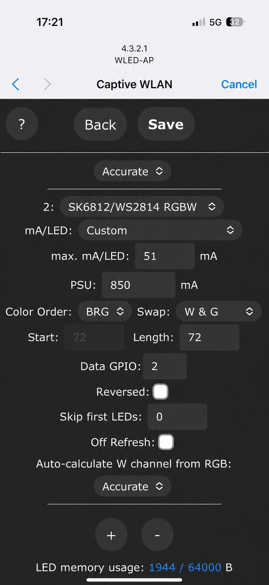

# H705D / SM6812 Firmware Flashing Guide for macOS

This guide explains how to flash the H705D ESP32 controller from a Mac through its CP2102 USB-to-UART interface.

## Important Package Information

- `firmware/SM6812/SK6812.bin` is the H705D/SM6812 application firmware.
- For a complete recovery flash, use all four `.bin` files at the offsets listed below.

## 1. Connect the Controller

Use a USB cable that supports data transfer, not a charge-only cable. Connect the H705D controller directly to the Mac when possible rather than through an unpowered USB hub.

Open **Terminal** and list the available serial ports:

```bash
ls /dev/cu.*
```

A detected CP2102 interface commonly appears as one of the following:

```text
/dev/cu.SLAB_USBtoUART
/dev/cu.usbserial-0001
```

The exact suffix may be different on your Mac.

## 2. Install the CP2102 Driver if Required

Recent macOS versions may recognize the adapter automatically. If no new `/dev/cu.*` device appears after connecting the controller, download **CP210x VCP Mac OSX Driver** from the official Silicon Labs page:

- [Silicon Labs CP210x VCP drivers](https://www.silabs.com/software-and-tools/usb-to-uart-bridge-vcp-drivers?tab=downloads)

After installation:

1. Open **System Settings → Privacy & Security**.
2. Allow the Silicon Labs system software if macOS displays an approval request.
3. Restart the Mac if requested.
4. Reconnect the controller and run `ls /dev/cu.*` again.

## 3. Recommended Method — Espressif esptool

Espressif's `esptool` works on both Intel and Apple silicon Macs. Python 3.10 or newer is recommended for the current release.

### Install esptool in an Isolated Environment

```bash
python3 -m venv ~/h705d-esptool
source ~/h705d-esptool/bin/activate
python -m pip install --upgrade pip esptool
```

Change to the downloaded repository directory. For example:

```bash
cd ~/Downloads/wled
```

Identify the controller port:

```bash
ls /dev/cu.*
```

The commands below use `/dev/cu.SLAB_USBtoUART` as an example. Replace it with the port shown on your Mac.

### Test the Connection

```bash
python -m esptool --chip esp32 --port /dev/cu.SLAB_USBtoUART chip-id
```

### Perform a Complete H705D Flash

The complete flash uses the supplied bootloader, partition table, boot app, and `SK6812.bin` application firmware at their required offsets:

```bash
python -m esptool \
  --chip esp32 \
  --port /dev/cu.SLAB_USBtoUART \
  --baud 460800 \
  --before default-reset \
  --after hard-reset \
  write-flash \
  --flash-mode dio \
  --flash-freq 40m \
  --flash-size detect \
  0x1000 firmware/SM6812/bootloader_dout_40m.bin \
  0x8000 firmware/SM6812/partitions.bin \
  0xe000 firmware/SM6812/boot_app0.bin \
  0x10000 firmware/SM6812/SK6812.bin
```

The flash layout is:

| File | Offset | Purpose |
| --- | ---: | --- |
| `bootloader_dout_40m.bin` | `0x1000` | ESP32 bootloader |
| `partitions.bin` | `0x8000` | Partition table |
| `boot_app0.bin` | `0xe000` | OTA boot data |
| `SK6812.bin` | `0x10000` | H705D/SM6812 application firmware |

Do not write `SK6812.bin` at `0x0`. It is the application image and belongs at `0x10000` when using `esptool` directly.

If flashing is unstable, repeat the command with `--baud 115200`.

### If the ESP32 Does Not Connect

1. Hold **Button 0 (GPIO0)**.
2. Press Reset, or disconnect and reconnect USB while continuing to hold Button 0.
3. Start the esptool command.
4. Release Button 0 when esptool begins connecting.
5. Restart the controller after flashing finishes.

Also close serial monitors or other programs that may be using the port.

## 4. Optional macOS Graphical Flasher

NodeMCU PyFlasher provides macOS `.dmg` releases and is the macOS counterpart of the simple ESP-Flasher interface:

- [NodeMCU PyFlasher releases](https://github.com/marcelstoer/nodemcu-pyflasher/releases)

Download the macOS asset, not the Windows `.exe`. If macOS blocks the application, open **System Settings → Privacy & Security** and use **Open Anyway** only after confirming that the download came from the official release page.

For a new or fully erased controller, the complete esptool procedure above is preferred because it writes every required image at its documented offset. A single-file graphical flash of `SK6812.bin` should only be used when the controller already has the correct H705D bootloader and partition table.

## 5. Install Standard WLED Online and Configure H705D Manually

Yes. The official [WLED web installer](https://install.wled.me/) can install standard WLED on the ESP32, after which the H705D GPIO assignments can be configured manually. This is a convenient option when standard WLED provides all the features you need.

Use desktop **Chrome or Edge** on the Mac; Safari does not support the Web Serial workflow used by the installer.

1. Connect the H705D controller to the Mac through USB.
2. Open [install.wled.me](https://install.wled.me/).
3. Click **Install** and select the CP2102 serial port.
4. Select the standard ESP32 build. Select an Audioreactive build if microphone-driven effects are required and that option is offered for the selected WLED release.
5. Wait for installation to finish without disconnecting USB or power.
6. Connect to the `WLED-AP` Wi-Fi network. The default password is `wled1234`.
7. Open `http://4.3.2.1`, then open **Config → LED Preferences**.

### Set the Correct Data GPIO

The screenshot below shows `Data GPIO: 2`, which is the correct setting for the first H705D LED data output.



Set **Data GPIO** according to the physical H705D output connector:

| H705D connector | WLED Data GPIO |
| --- | ---: |
| First LED data output (OUT1) | `GPIO2` |
| Second LED data output (OUT2) | `GPIO15` |

- If the LED strip is connected to the **second output**, change the value shown in the screenshot from `2` to **`15`**.
- If the LED strip is connected to the **first output**, set it to **`2`**.
- Click **Save** after changing the setting.

For an SK6812 RGBW strip, select the matching `SK6812/WS2814 RGBW` output type and configure the correct LED count and color order for the connected strip.

### Configure Both Outputs

If both physical outputs are in use:

1. Configure the first LED output with **Data GPIO 2**.
2. Click the **+** button in the LED outputs section.
3. Configure the second LED output with **Data GPIO 15**.
4. Enter the LED length for each output. WLED normally assigns the second output's start index after the end of the first output.
5. Save and restart WLED.

WLED supports multiple outputs and allows their GPIO pins, lengths, and color order to be configured at runtime.

### Standard WLED Versus the H705D Firmware Package

The official installer loads a standard WLED build, not this repository's custom `SK6812.bin`. Manual GPIO configuration makes the LED outputs usable, but any H705D-specific defaults or customizations included in `SK6812.bin` will not be installed automatically.

Use the complete esptool procedure in this document if you specifically need the repository's H705D firmware. Use the official WLED installer when you prefer standard WLED and are comfortable configuring the controller manually.

### Browser Flashing Is Technically Possible

ESP Web Tools can flash an ESP32 from a Chromium-based browser when a project supplies a compatible manifest containing all required files and offsets. For this package, that manifest must map:

- `bootloader_dout_40m.bin` → `0x1000`
- `partitions.bin` → `0x8000`
- `boot_app0.bin` → `0xe000`
- `SK6812.bin` → `0x10000`

This requires a dedicated H705D web installer; it is not the same as selecting the generic firmware on `install.wled.me`. Chrome or Edge is required because Safari does not provide the Web Serial workflow used by ESP Web Tools.

### Updating an H705D That Already Runs WLED

If the controller is already running a compatible H705D WLED build, an application-only update may be performed from the controller's WLED interface:

1. Back up the WLED configuration and presets.
2. Open the controller's WLED web interface.
3. Open **Config → Security & Updates**.
4. Under **Manual OTA Update**, select `firmware/SM6812/SK6812.bin`.
5. Start the update and keep power connected until the controller restarts.

Use OTA only when the existing bootloader and partition layout are already compatible. For an erased controller, a failed controller, or an unknown previous firmware, use the complete USB/esptool procedure.

## 6. Safety and Troubleshooting

- Keep USB and controller power connected throughout the flash.
- Use only the files from the same H705D package; do not mix bootloader or partition files from another build.
- If no serial port appears, try another data-capable cable, USB port, or adapter before reinstalling the driver.
- If access to the port is denied, close every serial application and reconnect the controller.
- If the firmware writes successfully but does not boot, repeat the complete four-file flash and confirm every offset.
- Verify downloaded files against `SHA256SUMS.txt` before flashing.

## References

- [Silicon Labs CP210x VCP drivers](https://www.silabs.com/software-and-tools/usb-to-uart-bridge-vcp-drivers?tab=downloads)
- [Espressif esptool documentation](https://docs.espressif.com/projects/esptool/en/latest/esp32/)
- [ESP Web Tools documentation](https://esphome.github.io/esp-web-tools/)
- [Official WLED web installer](https://install.wled.me/)
